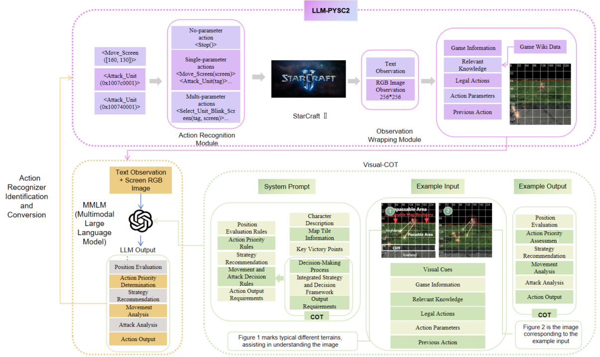

# 基于视觉引导思维链的《星际争霸II》学习环境

[LLM-PySC2](https://github.com/NKAI-Decision-Team/LLM-PySC2) 是由 [南开大学智能决策团队](https://github.com/orgs/NKAI-Decision-Team/repositories) 和 [国防科技大学大数据与决策实验室](https://www.nudt.edu.cn/) 合作开发的学习环境。该平台基于 [DeepMind PySC2](https://github.com/deepmind/pysc2)，为 **大型语言模型（LLMs）** 提供了在《星际争霸II》中进行宏观决策和微操控制的能力。

本实验针对单巨像VS 32小狗地图，在LLM-PYSC中增加 **Visual-CoT（视觉引导思维链）** 框架，融合视觉信息和链式推理（Chain-of-Thought, CoT），显著提升了 LLM 在复杂策略场景下的动作精细化控制能力。实验表明，Visual-CoT 在单巨像对战32跳虫的高难度场景中胜率达到 **45%**，充分展示了视觉信息在策略规划与执行中的价值。

------

## **关键功能**

1. **主流 LLM 支持**：支持 GPT-4、GPT-3.5 等多种语言模型。
2. **宏观与微观决策**：结合高级策略规划与精细化动作控制。
3. **多智能体协作**：支持异构智能体、通信与协作研究。
4. **视觉引导的思维链**：通过引入视觉输入，增强 LLM 的场景理解和动作生成能力。
5. **丰富的实验任务**：包含 24 个 `llm_pysc2` 任务和 9 个 `llm_smac` 任务。
6. **完整动作空间支持**：支持几乎所有单位技能及动作，涵盖星灵种族，后续将加入虫族与人族支持。
7. **实验并行化**：支持多智能体并行实验，提高研究效率。
8. **全面日志记录**：提供详细的实验数据记录和分析功能。
9. **新增支持**：在原有任务基础上新增 **Visual-CoT 地图**，地图名称为 `2024DeepGreen.SC2Map`。此地图专为 Visual-CoT 框架设计，模拟了单巨像（Colossus）对战32跳虫（Zerglings）的复杂战斗环境，提供了挑战性的视觉引导策略测试场景。

------

## **Visual-CoT 框架**

Visual-CoT 是一种结合视觉信息与链式推理的创新框架，能够使 LLM：

- 从 **RGB 图像**中提取空间和策略关键信息。
- 将这些信息与文本提示结合，在多模态推理中优化决策。
- 基于综合分析生成精细化动作，提升复杂任务的表现。

### **框架结构图**

以下是 Visual-CoT 框架的整体结构图：

<p align="center">
  
</p>

### **工作原理**

1. **视觉信息采集**：通过 LLM-PySC2 的观察包装器获取游戏实时屏幕截图。
2. **提示词生成**：将视觉信息嵌入到链式推理提示词中，为 LLM 提供任务背景和视觉辅助信息。
3. **链式推理**：LLM 基于多模态输入完成思维链思考，逐步分析战场态势并制定具体行动策略。
4. **动作输出**：LLM 输出精细化的操作指令，用于控制游戏单位。

Visual-CoT 的设计使得视觉信息成为决策过程中的核心因素，大幅提升了 LLM 在复杂策略任务中的表现。

## **快速开始**

### **安装《星际争霸II》**

按照 [Blizzard 官方指南](https://github.com/Blizzard/s2client-proto#downloads) 下载支持 API 的《星际争霸II》版本（3.16.1 或以上）。默认路径为：

```
~/StarCraftII/
```

如需自定义路径，可通过设置 `SC2PATH` 环境变量进行修改。

### **安装 LLM-PySC2**

克隆项目并安装依赖：

```bash
$ git clone https://github.com/NKAI-Decision-Team/LLM-PySC2.git
$ cd LLM-PySC2
$ conda create --name YOUR_ENV_NAME python==3.9
$ conda activate YOUR_ENV_NAME
$ pip install -e .
```

### **添加地图**

将项目中的地图文件复制到《星际争霸II》安装路径的 Maps 文件夹中：

```
llm_pysc2/maps/llm_pysc2 -> C:\Program Files (x86)\StarCraft II\Maps\llm_pysc2
llm_pysc2/maps/llm_smac -> C:\Program Files (x86)\StarCraft II\Maps\llm_smac
```

### **运行 1c_vs_32.py 文件**

要运行 Visual-CoT 框架下的单巨像对战 32 小狗任务，可直接启动以下实验脚本：

```
$ python llm_pysc2/bin/llm_smac/1c_vs_32.py
```

该脚本将加载 `2024DeepGreen.SC2Map` 地图，并自动配置 LLM，以测试在复杂战斗场景下的精细化控制能力。

## **实验任务**

### **Visual-CoT 测试任务**

在《星际争霸II》的 PvZ 场景中测试 Visual-CoT 框架，单巨像对战跳虫：

利用地形和移动躲避跳虫围攻，进行精准反击。

- 地图名称：`2024DeepGreen.SC2Map`。
- 特点：包含高地、狭窄通道等复杂地形。
